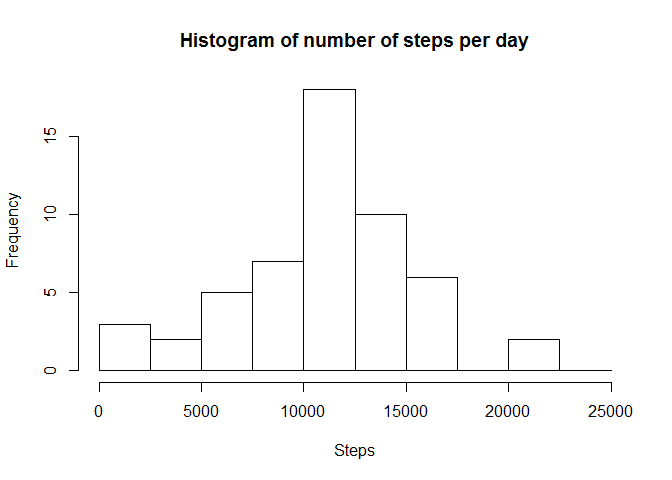
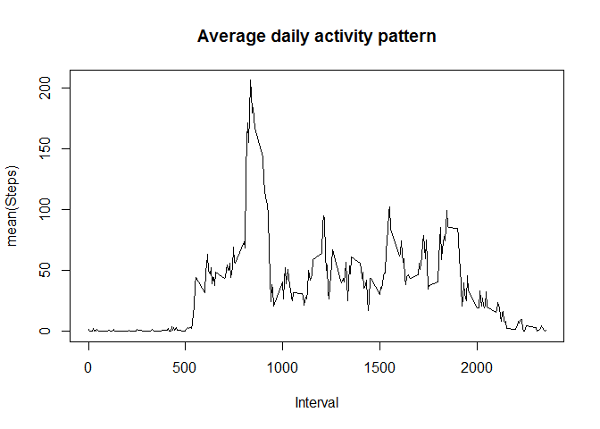
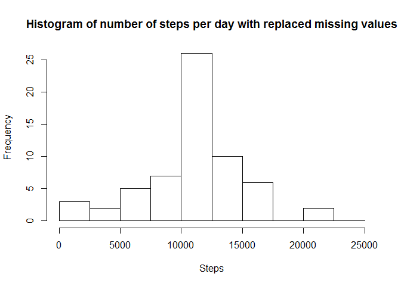
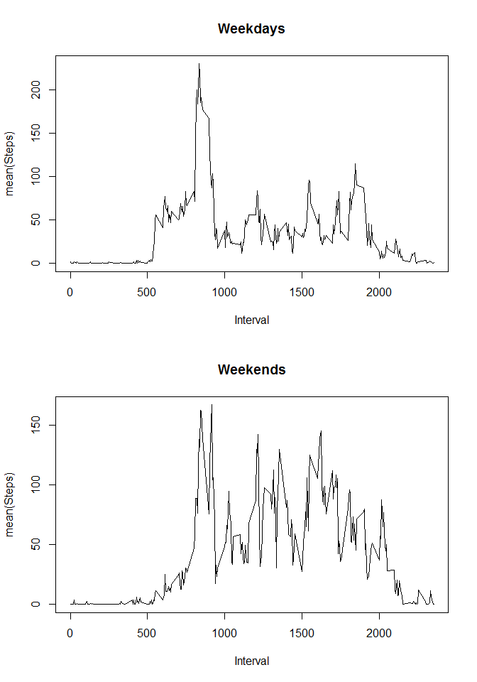

# Reproducible Research: Peer Assessment 1


## Loading and preprocessing the data


```r
unzip ('activity.zip', overwrite = TRUE)
activity <- read.csv('activity.csv')
```


## What is mean total number of steps taken per day?


```r
daily_activity <- aggregate(steps ~ date, activity, sum)
hist(daily_activity$steps, breaks = seq(0, 25000, 2500), 
     main = "Histogram of number of steps per day",
     xlab = "Steps")
```

 

```r
day_mean <- mean(daily_activity$steps, na.rm = T)
day_median <- median(daily_activity$steps, na.rm = T)
```

The mean number of steps per days is **10766** and the median is **10765**

## What is the average daily activity pattern?


```r
interval_mean <- aggregate(steps ~ interval, activity, mean)
plot(interval_mean$interval, interval_mean$steps, type = "l", 
     main = "Average daily activity pattern",
     xlab = "Interval", 
     ylab = "mean(Steps)")
```

 

```r
max_interval <- interval_mean[which.max(interval_mean$steps),1]
```

The interval with max number of steps is **835**. I.e. 8:35 in the morning.


## Inputing missing values

The original dataset is enriched by replacing the missing values with the corresponding mean value for that interval.


```r
#Fill empty with mean value
missing_values <- sum(is.na(activity$steps))
activity_filled <- activity
activity_filled$steps <- ifelse(is.na(activity_filled$steps), 
                                as.integer(interval_mean$steps), 
                                activity_filled$steps)
daily_activity_filled <- aggregate(steps ~ date, activity_filled, sum)

hist(daily_activity_filled$steps, breaks = seq(0, 25000, 2500), 
     main = "Histogram of number of steps per day with replaced missing values", 
     xlab="Steps")
```

 

```r
day_mean <- mean(daily_activity_filled$steps)
day_median <- median(daily_activity_filled$steps)
```

The number of missing values where **2304**.  
With the missing values replaced the mean number of steps per days is now **10750** and the median is **10641**.
The mean number is about the same as before, but the median has moved slightly.  
The number of intervals with around 10000 steps is about 5 more.


## Are there differences in activity patterns between weekdays and weekends?


```r
daytype <- c("weekend", "weekday", "weekday", "weekday", "weekday", "weekday", "weekend")
all_activity_week <- activity_filled
all_activity_week$daytype <- factor(daytype[as.POSIXlt(activity_filled$date)$wday + 1])
daily_activity_daytype <- aggregate(steps ~ daytype + interval, all_activity_week, mean)
weekdays <- subset(daily_activity_daytype, daytype == "weekday")
weekenddays <- subset(daily_activity_daytype, daytype == "weekend")

par(mfrow = c(2,1))
plot(weekdays$interval, weekdays$steps, type = "l", 
     main = "Weekdays",
     xlab = "Interval",
     ylab = "mean(Steps)")
plot(weekenddays$interval, weekenddays$steps, type = "l", 
     main = "Weekends",
     xlab = "Interval",
     ylab = "mean(Steps)")
```

 

The subjects seams to get going a bit later during the weekends. The activity is also spread out more during the day than on the weekdays.
